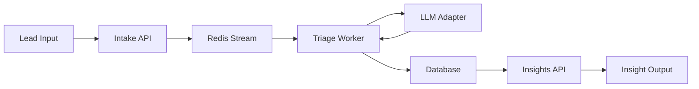

# 🎯 Lead Triage System (Test Case from AIgency)

> **Automated lead qualification system using event-driven architecture and LLM-powered insights**

[](https://www.python.org/)
[](https://fastapi.tiangolo.com/)
[](https://redis.io/)
[](https://www.postgresql.org/)
[](https://www.docker.com/)

---

## 📋 Table of Contents

- [Overview](#-overview)
- [Architecture](#-architecture)
- [Features](#-features)
- [Tech Stack](#-tech-stack)
- [Getting Started](#-getting-started)
- [API Documentation](#-api-documentation)
- [Testing](#-testing)
- [Project Structure](#-project-structure)
- [Task Requirements](#-task-requirements)

---

## 🎯 Overview

**Lead Triage System** is a microservices-based application that automatically processes and qualifies incoming leads using AI-powered analysis. The system accepts raw lead data with free-form notes, analyzes them through an LLM adapter, and generates structured insights including intent classification, priority scoring, and recommended next actions.

### Key Concept



**Flow:**
1. **Intake API** receives lead with free-text note → saves to DB → publishes event to queue
2. **Triage Worker** consumes event → calls LLM adapter → stores structured insight
3. **Insights API** provides access to generated insights

---

## 🏗️ Architecture

### System Components

```
┌─────────────────┐     ┌──────────────┐     ┌─────────────────┐
│   Intake API    │────▶│ Redis Stream │────▶│ Triage Worker   │
│   (FastAPI)     │     │   (Queue)    │     │   (Consumer)    │
└─────────────────┘     └──────────────┘     └─────────────────┘
         │                                             │
         ▼                                             ▼
┌─────────────────┐                          ┌─────────────────┐
│   PostgreSQL    │◀─────────────────────────│  LLM Adapter    │
│   (Database)    │                          │ (Rule-Based/AI) │
└─────────────────┘                          └─────────────────┘
         ▲
         │
┌─────────────────┐
│  Insights API   │
│   (FastAPI)     │
└─────────────────┘
```

### Design Principles

- ✅ **Microservices Architecture** - Independent, scalable services
- ✅ **Event-Driven** - Asynchronous processing via message queue
- ✅ **Idempotency** - Guaranteed exactly-once processing
- ✅ **Fault Tolerance** - Graceful error handling and retry mechanisms
- ✅ **Clean Architecture** - Separation of concerns, dependency injection

---

## ✨ Features

### Core Features

- 🔄 **Idempotent API** - Duplicate request protection via `Idempotency-Key`
- 📨 **Event-Driven Processing** - Redis Streams for reliable message delivery
- 🤖 **LLM Integration** - Pluggable AI adapters (Rule-Based, OpenAI-compatible)
- 🎯 **Smart Classification** - Intent, priority, and action recommendations
- 🔒 **Exactly-Once Semantics** - Duplicate prevention at database level
- 📊 **Structured Insights** - Transform free-text into actionable data

### Technical Features

- ⚡ **Async/Await** - High-performance async operations
- 🐳 **Docker Compose** - One-command deployment
- 🧪 **E2E Testing** - Comprehensive test coverage
- 📝 **Type Safety** - Pydantic schemas and type hints
- 🔍 **Observability** - Structured logging for monitoring

---

## 🛠️ Tech Stack

### Backend

| Component | Technology | Purpose |
|-----------|-----------|---------|
| **APIs** | FastAPI | High-performance async web framework |
| **Worker** | Python asyncio | Background message processing |
| **Database** | PostgreSQL | Persistent data storage |
| **Queue** | Redis Streams | Event streaming and message queue |
| **ORM** | SQLAlchemy 2.0 | Database abstraction layer |
| **Validation** | Pydantic | Data validation and serialization |

### Infrastructure

| Component | Technology | Purpose |
|-----------|-----------|---------|
| **Containerization** | Docker | Service isolation |
| **Orchestration** | Docker Compose | Multi-container management |
| **Testing** | pytest + pytest-asyncio | Automated testing |

---

## 🚀 Getting Started

### Prerequisites

- Docker & Docker Compose
- Python 3.11+ (for local development)
- Git

### Quick Start

1. **Clone the repository**
   ```bash
   git clone <repository-url>
   cd AIgency_test
   ```

2. **Start the services**
   ```bash
   # Production environment
   docker-compose up -d
   
   # Test environment
   docker-compose -f docker-compose.test.yml up -d
   ```

3. **Verify services are running**
   ```bash
   # Check service health
   curl http://localhost:8000/leads
   curl http://localhost:8001/leads
   ```

4. **Create your first lead**
   ```bash
   curl -X POST http://localhost:8000/leads/ \
     -H "Content-Type: application/json" \
     -H "Idempotency-Key: $(uuidgen)" \
     -d '{
       "email": "john@example.com",
       "name": "John Doe",
       "note": "Need urgent pricing for 50 seats ASAP!",
       "source": "website"
     }'
   ```

5. **Get the insight**
   ```bash
   # Replace {lead_id} with the ID from previous response
   curl http://localhost:8001/leads/{lead_id}/insight
   ```

### Service Endpoints

| Service | Port | URL |
|---------|------|-----|
| **Intake API** | 8000 | http://localhost:8000 |
| **Insights API** | 8001 | http://localhost:8001 |
| **PostgreSQL** | 5432 | localhost:5432 |
| **Redis** | 6379 | localhost:6379 |

---

## 📚 API Documentation

### Intake API

#### Create Lead

```http
POST /leads/
```

**Headers:**
- `Idempotency-Key: <uuid>` (required)
- `Content-Type: application/json`

**Request Body:**
```json
{
  "email": "user@example.com",
  "phone": "+1234567890",
  "name": "Alex Johnson",
  "note": "Need pricing for 20 seats next week. Budget approved.",
  "source": "landing-page"
}
```

**Responses:**

| Status | Description |
|--------|-------------|
| `201 Created` | Lead successfully created |
| `200 OK` | Idempotent request - returning cached response |
| `409 Conflict` | Idempotency key used with different data |
| `422 Unprocessable Entity` | Invalid request data |

**Response Example:**
```json
{
  "id": "550e8400-e29b-41d4-a716-446655440000",
  "email": "user@example.com",
  "phone": "+1234567890",
  "name": "Alex Johnson",
  "note": "Need pricing for 20 seats next week. Budget approved.",
  "source": "landing-page",
  "created_at": "2025-10-08T12:00:00Z"
}
```

#### Get Lead

```http
GET /leads/{lead_id}
```

**Responses:**

| Status | Description |
|--------|-------------|
| `200 OK` | Lead found |
| `404 Not Found` | Lead not found |

---

### Insights API

#### Get Insight

```http
GET /leads/{lead_id}/insight
```

**Responses:**

| Status | Description |
|--------|-------------|
| `200 OK` | Insight found |
| `404 Not Found` | No insight for this lead |

**Response Example:**
```json
{
  "id": "660e8400-e29b-41d4-a716-446655440001",
  "lead_id": "550e8400-e29b-41d4-a716-446655440000",
  "intent": "buy",
  "priority": "P0",
  "next_action": "call",
  "confidence": 0.85,
  "tags": ["urgent", "enterprise"],
  "created_at": "2025-10-08T12:00:05Z"
}
```

---

## 🧪 Testing

### Run Tests

```bash
# Run all E2E tests
pytest tests/ -v

# Run specific test
pytest tests/test_e2e_leads.py::test_e2e_lead_creation_and_insight -v

# Run with coverage
pytest tests/ --cov=. --cov-report=html
```

### Test Coverage

The test suite includes:

1. ✅ **E2E Flow Test** - Complete lead processing pipeline
2. ✅ **Idempotency Test (Same Data)** - Duplicate request handling
3. ✅ **Idempotency Test (Different Data)** - Conflict detection
4. ✅ **Duplicate Event Test** - Queue-level deduplication

**Test Output Example:**
```
tests/test_e2e_leads.py::test_e2e_lead_creation_and_insight PASSED
tests/test_e2e_leads.py::test_idempotency_same_key_same_body PASSED
tests/test_e2e_leads.py::test_idempotency_same_key_different_body PASSED
tests/test_e2e_leads.py::test_duplicate_event_no_duplicate_insight PASSED

====== 4 passed in 4.55s ======
```

---

## 📁 Project Structure

```
AIgency_test/
├── 📂 common/                    # Shared code between services
│   └── common/
│       ├── config.py            # Configuration management
│       ├── database.py          # Database connection
│       ├── enums.py             # Enum definitions
│       ├── models.py            # SQLAlchemy models
│       └── schemas.py           # Pydantic schemas
│
├── 📂 intake_api/               # Lead intake service
│   ├── main.py                  # FastAPI application
│   ├── lead_routes.py           # API endpoints
│   ├── dependencies.py          # DI and utilities
│   └── Dockerfile
│
├── 📂 insights_api/             # Insights retrieval service
│   ├── main.py                  # FastAPI application
│   ├── insights_routes.py       # API endpoints
│   └── Dockerfile
│
├── 📂 triage_worker/            # Background processing worker
│   ├── main.py                  # Worker entry point
│   ├── processor.py             # Message processing logic
│   ├── insight_service.py       # Business logic
│   ├── exceptions.py            # Custom exceptions
│   ├── llm_adapters/
│   │   ├── base.py              # Abstract LLM interface
│   │   └── rule_based.py        # Rule-based implementation
│   └── Dockerfile
│
├── 📂 tests/                    # E2E test suite
│   ├── conftest.py              # Test fixtures
│   └── test_e2e_leads.py        # E2E tests
│
├── 📂 alembic/                  # Database migrations
│   └── versions/
│
├── docker-compose.yml           # Production setup
├── docker-compose.test.yml      # Test environment
└── README.md                    # This file
```

---

<div align="center">
  <sub>Built with ❤️ using FastAPI, Redis Streams, and PostgreSQL</sub>
</div>
